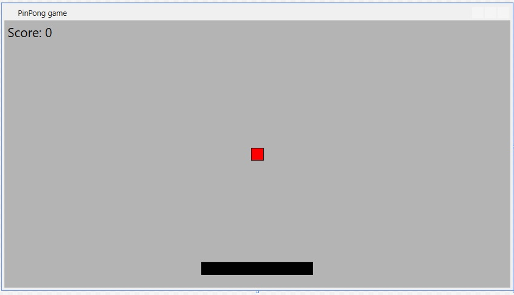

# PingPong Game

This project our first team work project in C#. This project introduced us the world of C# and we fell in love with it.

## Description

You can score points by hitting the ball with the padle. Works with the left, right, up and down keyword. You can pause the game with the space keyword, and quit with ESC keyword

## The vision

##
This project is under heavy reconstruction(started at 2021/01/23), and expected to be done beginning of February.
